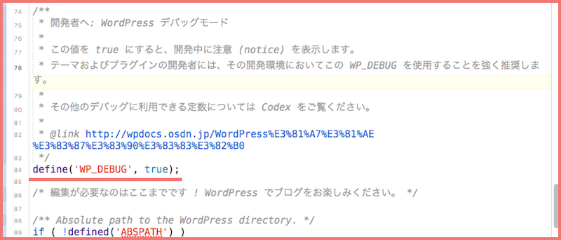
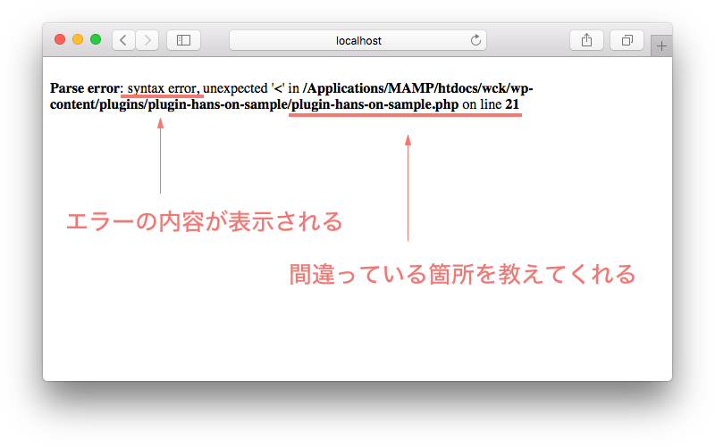
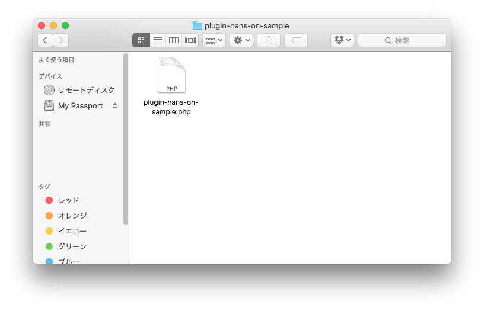
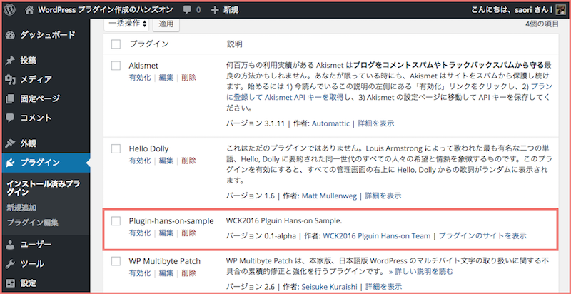

# 1. プラグイン化のメリット / プラグインの原型をつくる

## プラグイン化のメリット
### なぜプラグインにしておくとよいのか。functions.php に書いても同じようにうごくのに…？


functions.php のコードはそのテーマ独自のもの。プラグインならテーマが変わっても機能がそのままつかえる。  
:relaxed:**サイトリニューアルなどでテーマを変更した時に機能の移行作業しなくてもよい！**
  
functions.php に機能を付け足してコードを蓄積していくとカオスになる。  
:relaxed:**機能ごとにプラグイン化すると管理が楽！**
 
OG設定などの毎回使うような機能をプラグイン化しておくと使い回ししやすい。  
:relaxed:**作業の効率化に！**


## プラグインの原型をつくる

プラグインを作るその前に…:hand:  
WordPressのデバックモードをオンにして、間違った記述をしていたらエラーメッセージをだすようにしておきましょう。

### デバッグモードへの変更方法
WordPress本体を置いている一番上のディレクトリにある wp-config.php というファイルをテキストエディタで開き、  
84行目付近の define('WP_DEBUG', false); となっている箇所を、define('WP_DEBUG', true); に変更します。



これで何故か真っ白になってしまったけど、なにがおかしいのかわからないということがなくなります。  

#### デバッグモードでのエラー表示

書いたコードに間違いがあった場合以下のようなエラーメッセージが表示がされます。
  
syntax error というのは構文が間違っていますよというメッセージ。  
どのファイルのどの行が間違っているのかを教えてくれるので、その箇所を確認してみましょう。  

よくわからないエラーメッセージが表示された場合は、そのメッセージを Google で検索！なにかしら回答が得られることでしょう。


### WordPress にプラグインとして認識されるファイルをつくってみよう！

プラグインの原型となるファイルを作ります。  

デスクトップでもどこでもいいので、plugin-hans-on-sample というフォルダを作りその中に plugin-hans-on-sample.php というファイルを作りましょう。 


 
作った plugin-hans-on-sample.php ファイルに以下のコードを貼り付けます。  

```
<?php
/**
 * Plugin Name: Plugin-hans-on-sample
 * ↑プラグイン名
 * Version: 0.1-alpha
 * ↑バージョン
 * Description: WCK2016 Plguin Hans-on Sample.
 * ↑概要
 * Author: WCK2016 Plguin Hans-on Team
 * ↑作者名
 * Author URI: https://2016.kansai.wordcamp.org/
 * ↑作者サイトアドレス
 * Plugin URI: https://github.com/wckansai2016/plugin-hands-on-sample
 * ↑プラグイン公開アドレス
 * Text Domain: plugin-hans-on-sample
 * Domain Path: /languages
 * @package Plugin-hans-on-sample
 */
```
「Plugin Name」だけの記入でもOKです。    

そして plugin-hans-on-sample フォルダを WordPress の wp-content → plugins フォルダにおきます。  
  
WordPress の管理画面 > プラグイン の画面を確認してみましょう！


  
プラグイン名やプラグイン概要などが反映されています！！  
「有効化」ボタンをクリックすれば、晴れてプラグインとして機能するようになります:smile:  
   
functions.php に書いていくように hans-on-sample.php ファイルへコードを書いていけば WordPress へ機能が反映されます。   

:wavy_dash::wavy_dash::wavy_dash::wavy_dash::wavy_dash::wavy_dash:
    
ブログなどでよくみかける「この記事は○分で読めます」という、本文の文字数によって何分くらいで読めるかのお知らせを表示するコードをこの plugin-hans-on-sample.php ファイルに書いてプラグインをつくってみましょう！

[ Next >>：2.ショートコードを使って「この記事は○分で読めます」プラグインをつくる](https://github.com/wckansai2016/plugin-hands-on/blob/master/plugin_hands_on_2.md) 
