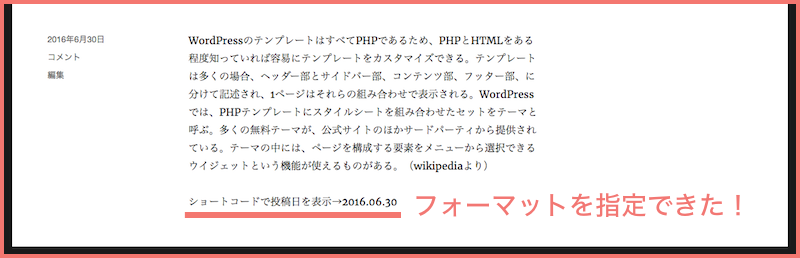
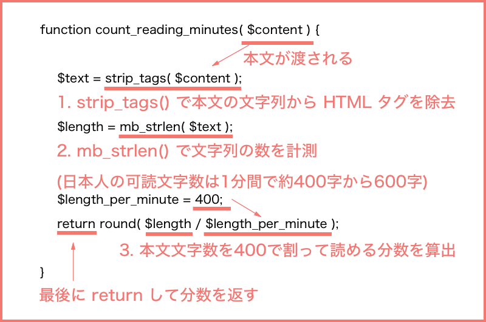
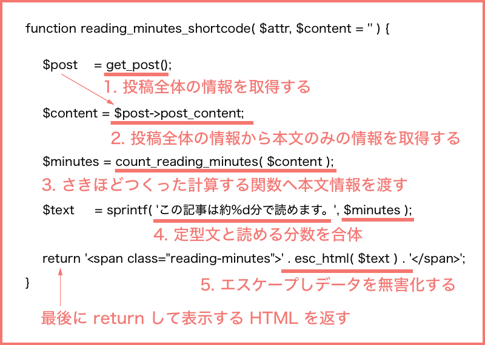

#2. ショートコードを使って「この記事は○分で読めます」プラグインをつくる
WordPress のショートコードという機能を使ってプラグインをつくります。


##ショートコードについて知ろう

###ショートコードとは

投稿記事内で WordPress のテンプレートタグや PHP のコードを実行するための仕組みです。

通常 WordPress の投稿記事内ではテンプレートタグを使ったり PHP を実行させることはできません。  
しかし、あらかじめショートコードに実行させたいコードを登録しておけば、投稿記事内でそのコードを実行することができます。

例えば、shortcode-sample という名前のショートコードに、投稿した日にちを表示する関数 get_the_date() を登録したとします。（登録の仕方はのちほど説明します）　　　

投稿記事に[shortcode-sample]と[ ]でショートコード名を囲って記入すると、ショートコードを記入した箇所に投稿した日にちを表示できるようになります。　　

```
[shortcode-sample] // 投稿の日付を表示するショートコード
```


囲む形のショードコードもあります。[shortcode-sample]ショートコードサンプル[/shortcode-sample] のように本文のテキストや画像などを囲んで、その囲んだものに対してなにかしらの加工をしたりできます。

###ショートコードの登録の仕方

ショートコードを登録するには、add_shortcode というWP関数を使います。  

:link:[関数リファレンス/add shortcode - WordPress Codex 日本語版](http://wpdocs.osdn.jp/%E9%96%A2%E6%95%B0%E3%83%AA%E3%83%95%E3%82%A1%E3%83%AC%E3%83%B3%E3%82%B9/add_shortcode)  
  
プラグインファイルへ add_shortcode( 'ショートコード名', '実行する関数名' ) と、ショートコード名・実行したい関数名を記述します。  
  
前項で例にした、投稿した日にちを表示する関数 get_the_date() を実行したい場合は以下のように記述します。

```
function shortcode_sample_func() {
    return '<p>ショートコードで投稿日を表示→'.get_the_date().'</p>';
}
add_shortcode( 'shortcode-sample', 'shortcode_sample_func' );
```
   
ショートコードで実行する関数には echo するような処理を入れてはいけません。echo はもちろんですが、the_date() など echo するような関数も使用してはダメです。意図した形で表示できなくなってしまいます。

:wavy_dash::wavy_dash::wavy_dash::wavy_dash::wavy_dash::wavy_dash:

ショートコードの引数については今回のプラグインでは使わない機能なので説明は割愛します。  
ショートコードを使ってまた違うことをしたい時のご参考までに…

###ショートコードの引数について

実行する関数に引数を渡して処理することも可能です。  
任意の引数を渡すにはショートコードを記入する際に以下のように記入します。

```
[shortcode_sample example="value"]
```

ショートコードに = で記入された値は、関数側の第一引数で連想配列で取得できます。
受け取ると、= 前の文字列が配列のキーに、= の後の文字列が値として配列に入っています。  

```
function 呼び出す関数名( $attr ) {

	var_dump( $attr );
	↓
	array(1) { 
 		["example"]=> string(5) "value" 
	}
	
    return ;
}
add_shortcode( 'shortcode-sample', 'shortcode_sample_func' );

```

使い方の例として…、

日付のフォーマットを format="Y.m.d" と指定して渡すと、  

```
[shortcode-sample format="Y.m.d"]
```

実行する関数側の第一引数で format="Y.m.d" を配列で受け取ることができます。　　
以下のように投稿した日にちを表示する関数 get_the_date() の引数に受け取った値を当てはめるようにすると、  
投稿日付のフォーマットを指定できるようになります。

```
function shortcode_sample_func( $attr ) {
     return '<p>ショートコードで投稿日を表示→'.get_the_date( $attr["format"] ).'</p>';
}
add_shortcode( 'shortcode-sample', 'shortcode_sample_func' );
```
↓  


ショートコードの第二引数では、ショートコードで囲んだ部分のコンテンツを取得できます。

```
[shortcode-sample]ショートコードサンプル[/shortcode-sample]
```
↓  

```
var_dump( $content );
↓
string(33) "ショートコードサンプル" 
```
:wavy_dash::wavy_dash::wavy_dash::wavy_dash::wavy_dash::wavy_dash:  

ここから本題…:muscle:  
「この記事は○分で読めます」を表示する機能を作ってショートコード化していきます。

##「この記事は○分で読めます」を表示するにはどのような処理が必要?？

###1.本文のテキストの文字数を数えて何分で読めるのかを算出する  

    
###2.計算した分数と定型文「この記事は○分で読めます」を合わせて表示する  


###3.ショートコード化する


それでは具体的にコードを書いていきましょう！  
##本文のテキストが何分で読めるかを計算する関数を作る

以下の関数で文字列の塊が何分で読めるのかが計算できます。  

```
function count_reading_minutes( $content ) {
	$text = strip_tags( $content );
	$length = mb_strlen( $text );
	$length_per_minute = 400; 
	return round( $length / $length_per_minute );
}
```
###この関数の中身の説明
　　

1.渡された文字列からHTMLタグを除去   
  
　文字列には a タグなどの HTML が混ざっているので、PHP の strip_tags を使って HTML を取り除き純粋なテキストにします。
   
2.文字列の数を計測  
  
　純粋なテキストになったところで mb_strlen() 関数で文字数を数えます。

3.分数を計算  
  
　1分間で約400字が読めるとしてテキスト数を 400 で割り、round()関数で小数点以下を四捨五入したものを返します。


この関数をプラグインファイルへ記入できたら以下のテキストを本文と見立てて count_reading_minutes() 関数に渡してみます。

「親譲りの無鉄砲で小供の時から損ばかりしている。小学校に居る時分学校の二階から飛び降りて一週間ほど腰を抜かした事がある。なぜそんな無闇をしたと聞く人があるかも知れぬ。別段深い理由でもない。新築の二階から首を出していたら、同級生の一人が冗談に、いくら威張っても、そこから飛び降りる事は出来まい。弱虫やーい。と囃したからである。小使に負ぶさって帰って来た時、おやじが大きな眼をして二階ぐらいから飛び降りて腰を抜かす奴があるかと云ったから、この次は抜かさずに飛んで見せますと答えた。（青空文庫より）」

以下のコードを先ほど書いた関数の下にコピー&ペーストして保存し、画面をリロードして下さい。

```
$content = '親譲りの無鉄砲で小供の時から損ばかりしている。小学校に居る時分学校の二階から飛び降りて一週間ほど腰を抜かした事がある。なぜそんな無闇をしたと聞く人があるかも知れぬ。別段深い理由でもない。新築の二階から首を出していたら、同級生の一人が冗談に、いくら威張っても、そこから飛び降りる事は出来まい。弱虫やーい。と囃したからである。小使に負ぶさって帰って来た時、おやじが大きな眼をして二階ぐらいから飛び降りて腰を抜かす奴があるかと云ったから、この次は抜かさずに飛んで見せますと答えた。（青空文庫より）';
$minutes = count_reading_minutes( $content );
var_dump( $minutes );
```
右クリックでソースコードを表示を選択するとソースが表示されると思います、一番上の行を確認してみましょう。

float(1) と表示されているはず…、
1分で読めるという計算結果になりました。これで何分で読めるのかを計算する関数は完成です:thumbsup:

※float とは浮動小数点数という型ですという意味。ここでは算出した数値が 1 だったと思って頂けばOK。

##計算した分数と定型文「この記事は○分で読めます」を合わせて表示する関数を作る

以下の関数で計算した分数と定型文を合わせて表示することができます。 

```
function reading_minutes_shortcode( $attr, $content = '' ) {

	$post    = get_post(); // global $post とほぼ同じ動作。
	$content = $post->post_content;
	$minutes = count_reading_minutes( $content );
	$text     = sprintf( 'この記事は約%d分で読めます。', $minutes );

	//エスケープ大切！
	return '<span class="reading-minutes">' . esc_html( $text ) . '</span>';
}
```

###この関数の中身の説明
　

1.投稿記事の情報を取得  
  
　get_post() 関数でその投稿記事のIDやタイトル、パーマリンクなど総合的な情報を取得します。

2.投稿記事情報から本文をとりだす  
    
　総合的な記事情報から今回必要な本文部分を取り出します。

3.先につくった関数へ本文を渡す 
   
　本文部分をテキストが何分で読めるかを計算する関数 count_reading_minutes() へ渡します。

4.定型文を作り分数を入れる  
  
　PHP の sprintf() 関数を使って定型文と分数を合体させます。
　sprintf() の第一引数の %d と書いた部分に、第二引数で指定したものを整数として表示します。

5.「この記事は○分で読めます」を返す 
  
　4で作った「この記事は○分で読めます」のテキストを esc_html() 関数を使ってエスケープしデータを無害化して返します。  
　:link:[データ検証 - WordPress Codex 日本語版](http://wpdocs.osdn.jp/%E3%83%87%E3%83%BC%E3%82%BF%E6%A4%9C%E8%A8%BC)
   

ここまでできたら完成間近…。
   
##ショートコード化する

ここまでに作った reading_minutes_shortcode() 関数をショートコードに登録して投稿記事内で呼び出せるようにします。 

```
add_shortcode( 'reading-minutes', 'reading_minutes_shortcode' );
```

これで[reading-minutes]というショートコードが完成！！  
実際に投稿記事へ[reading-minutes]と記述してみましょう:smile:  
  
:wavy_dash::wavy_dash::wavy_dash::wavy_dash::wavy_dash::wavy_dash:  
 
[ Next >>：3.フィルターフックを使って「この記事は約○分で読めます。」を自動で表示してみよう](https://github.com/wckansai2016/plugin-hands-on/blob/master/plugin_hands_on_3.md)   
[<< Back：1.プラグイン化のメリット / プラグインの原型をつくる](https://github.com/wckansai2016/plugin-hands-on/blob/master/plugin_hands_on_1.md)   
  
  
