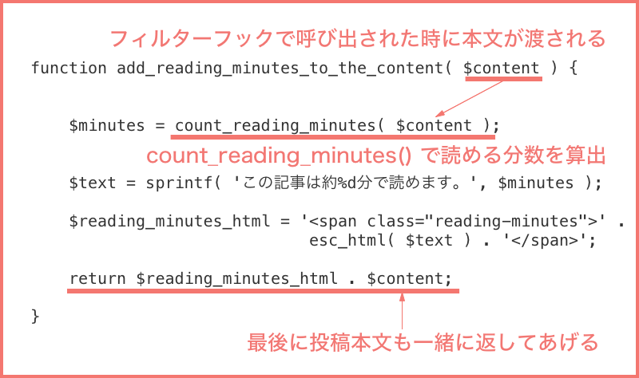

#3. フィルターフックを使って「この記事は約○分で読めます。」を自動で表示してみよう

ショートコードを投稿記事にいちいち入力するのめんどくさい:sweat:  
↓  
フィルターフックを使って投稿記事本文の前に自動的に表示するようにしてみよう:relieved:！

##フィルターフックとは

WordPress 本体やプラグインの動作・表示などをコアファイルを改変することなくカスタマイズできる仕組みのことです。  
  
WordPress 本来の動作を変更したい時に、コアファイルを改変してしまうと予期せぬ不具合が起きたり、WordPress のアップデートの際にカスタマイズした部分が消えてしまったりします。  
  
そのようなことがおきないよう、WordPress には安全にカスタマイズするための仕組みが用意されています。  

今から行おうとしている投稿記事の前にテキストを表示したいというようなカスタマイズの場合、  
投稿記事本文に対して処理するための「the_content」というフィルターフックが用意されています。   
「the_content」に対してこんな処理を追加したいという記述をすれば、その処理を行った本文が表示されるようになります。
     
:link: [プラグイン API/フィルターフック一覧 - WordPress Codex 日本語版](http://wpdocs.osdn.jp/%E3%83%97%E3%83%A9%E3%82%B0%E3%82%A4%E3%83%B3_API/%E3%83%95%E3%82%A3%E3%83%AB%E3%82%BF%E3%83%BC%E3%83%95%E3%83%83%E3%82%AF%E4%B8%80%E8%A6%A7) 
  
  
##フィルターフックの使い方

以下のように add_filter() 関数を使用して、機能を追加したいフィルターフックと機能を記述します。  
これはプラグインファイルや functions.php へ記入します。  

```
add_filter('フィルターフック名', '行いたい処理の関数名');
function 行いたい処理の関数名(){
	〜行いたい処理〜
}
```

  
##フィルターフックで自動的に表示する機能を追加する

追加したい機能の関数を作ります。

```
function add_reading_minutes_to_the_content( $content ) {
	$minutes              = count_reading_minutes( $content );
	$text                 = sprintf( 'この記事は約%d分で読めます。', $minutes );
	$reading_minutes_html = '<span class="reading-minutes">' . esc_html( $text ) . '</span>';

	return $reading_minutes_html . $content;
}
```

表示する機能自体はショートコードで作った関数とほぼ同じです。  
    
  


引数にはフィルターフックで呼び出された時に本文の情報が渡されるので、それをショートコードを作った時の関数 count_reading_minutes() へ渡し何分で読めるかを算出します。 
 
 
それを定型文と合わせて表示するという仕組みです。  

ショートコードの時とちがうのは、最後に処理された値を返す時に本文の情報も一緒に返すところです。
ここで一緒に本文の情報を付けないと、本文が空になってしまいます。


そして、この関数を add_filter() 関数を使って、記事本文をカスタマイズするための the_content フィルターフックと結びつけます。

```
add_filter( 'the_content', 'add_reading_minutes_to_the_content' );
```

投稿の表示を確認してみましょう。自動的に記事が何分で読めるのかのテキストを表示できるようになっているはずです:smile:

##オリジナルのフィルターフックを作ることもできます
  
プラグインやテーマを作る時に利用する人がカスタマイズを簡単にできるように、フィルターフックを作っておいてあげることもできます。  
オリジナルのフィルターフックを作るには apply_filters() という WP関数で作成できます。

ご興味がある方は apply_filters() の作成方法も確認してみて下さいね。

:link: [関数リファレンス/apply filters \- WordPress Codex 日本語版](https://wpdocs.osdn.jp/%E9%96%A2%E6%95%B0%E3%83%AA%E3%83%95%E3%82%A1%E3%83%AC%E3%83%B3%E3%82%B9/apply_filters)
  

[ Next >>：4.アクションフックを使って「この記事は約○分で読めます」にスタイルをあててみよう](https://github.com/wckansai2016/plugin-hands-on/blob/master/plugin_hands_on_4.md)   
[<< Back：2.ショートコードを使って「この記事は○分で読めます」プラグインをつくる](https://github.com/wckansai2016/plugin-hands-on/blob/master/plugin_hands_on_2.md)   


