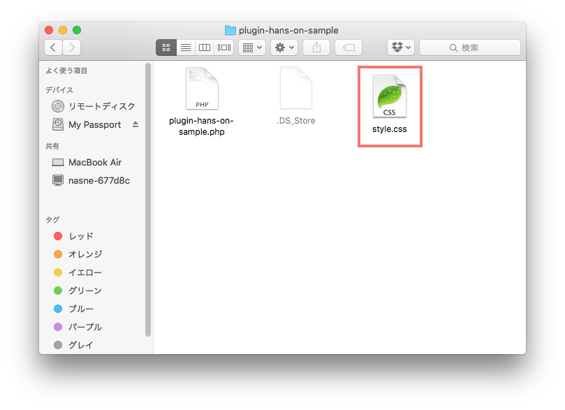

# 4. アクションフックを使って「この記事は約○分で読めます」にスタイルをあててみよう

「この記事は約○分で読めます」の HTML へ CSS でスタイルをあててデザインを変えてみましょう:blush:  
スタイルシートの追加をアクションフックを使って行います。
 
  
## アクションフックとは

アクションフックもフィルターフックと同じくコアファイルを改変せずにカスタマイズできる仕組みの1つですが、  
アクションフックは WordPress の何かのイベント（ヘッダーを表示する時や投稿を保存する時など）に応じて処理を差し込んだり、追加されている処理を削除することができます。
     
:link: [プラグイン API/アクションフック一覧 - WordPress Codex 日本語版](http://wpdocs.osdn.jp/%E3%83%97%E3%83%A9%E3%82%B0%E3%82%A4%E3%83%B3_API/%E3%82%A2%E3%82%AF%E3%82%B7%E3%83%A7%E3%83%B3%E3%83%95%E3%83%83%E3%82%AF%E4%B8%80%E8%A6%A7)
    
## アクションフックの使い方
  
使い方もフィルターフックと似ています。  
処理を追加したい場合は add_action() 関数を使って、追加したい処理が書かれた関数と合わせて記述します。  
   

```
add_action('アクションフック名', '行いたい処理の関数名');
function 行いたい処理の関数名(){
	〜行いたい処理〜
}
```  

## CSSファイルを作る

WordPress の wp-content → plugins → plugin-hans-on-sample フォルダを開き、中に style.css ファイルを作成します。


## 「この記事は約○分で読めます」にあてるスタイルシートをアクションフックで読み込む
  
プラグインフォルダに作った style.css を読み込む関数を作ります。

```
function add_reading_minutes_styles() {
	wp_enqueue_style( 'plugin-hans-on-sample', plugin_dir_url( __FILE__ ) . 'style.css' );
}
```

wp_enqueue_style() 関数を使ってプラグインフォルダに置いた style.css ファイルを読み込むように登録します。
  
そして、この関数を wp_enqueue_scripts アクションフックで呼び出すように登録します。  
※wp_enqueue_scripts アクションフックは登録されているスクリプトを読み込むタイミングで実行されるものです。

```
add_action( 'wp_enqueue_scripts', 'add_reading_minutes_styles' );
```

好きなスタイルを style.css に書いてデザインを変更してみましょう:beers:！　　

## オリジナルのアクションフックを作ることもできます

フィルターフックと同じくアクションフックもオリジナルのアクションフックを作ることができます。  
オリジナルのアクションフックを作るには do_action() という WP関数で作成できます。

こちらもご興味がある方は do_action() の作成方法も確認してみて下さいね。

:link: [関数リファレンス/do action \- WordPress Codex 日本語版](https://wpdocs.osdn.jp/%E9%96%A2%E6%95%B0%E3%83%AA%E3%83%95%E3%82%A1%E3%83%AC%E3%83%B3%E3%82%B9/do_action)

:wavy_dash::wavy_dash::wavy_dash::wavy_dash::wavy_dash::wavy_dash:  
  
[ Next >>：(追加) 5.ショートコードに引数を渡して表示する時間の単位を変えてみよう ](https://github.com/wckansai2016/plugin-hands-on/blob/master/plugin_hands_on_5.md)   
[<< Back：3.フィルターフックを使って「この記事は約○分で読めます。」を自動で表示してみよう](https://github.com/wckansai2016/plugin-hands-on/blob/master/plugin_hands_on_3.md) 
