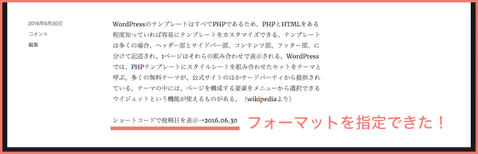

#（追加）5. ショートコードに引数を渡して表示する時間の単位を変えてみよう

  
##ショートコードの引数について

任意の引数を渡すにはショートコードを記入する際に以下のように記入します。

```
[shortcode_sample example="value"]
```

ショートコードに = で記入された値は、関数側の第一引数で連想配列で取得できます。
受け取ると、= 前の文字列が配列のキーに、= の後の文字列が値として配列に入っています。  

```
function 呼び出す関数名( $attr ) {

	var_dump( $attr );
	↓
	array(1) { 
 		["example"]=> string(5) "value" 
	}
	
    return ;
}
add_shortcode( 'ショートコード名', '呼び出す関数名' );

```

###ショートコード引数の使用例

以下のように日付のフォーマットとして format="Y.m.d" を渡したとすると  

```
[shortcode-sample format="Y.m.d"]
```

実行する関数側の第一引数で以下のような形で受け取ることができます。  

```
array(1) { 
	["format"]=> string(5) "Y.m.d" 
}
```

投稿した日にちを表示する関数 get_the_date() の引数に、受け取った値を当てはめると、  
投稿日付のフォーマットを指定できるようになります。

```
function shortcode_sample_func( $attr ) {
     return '<p>ショートコードで投稿日を表示→'.get_the_date( $attr["format"] ).'</p>';
}
add_shortcode( 'shortcode-sample', 'shortcode_sample_func' );
```
↓  


ショートコードの第二引数では、ショートコードで囲んだ部分のコンテンツを取得できます。

```
[shortcode-sample]ショートコードサンプル[/shortcode-sample]
```
↓  

```
var_dump( $content );
↓
string(33) "ショートコードサンプル" 
```
 
##表示する時間の単位を引数で指定できるようにする
  
```
function reading_minutes_shortcode( $attr, $content = '' ) {
	// [reading-minutes unit="m"] という形で引数を指定したい
	
	$param = shortcode_atts( array(
		'unit' => 'm',
	), $attr, 'reading-minutes' );
	// shortcode_atts()　でデフォルト値を設定
	// 何も指定がなかった場合は分で表示する
	
	$post    = get_post(); // global $post とほぼ同じ動作。
	$content = $post->post_content;
	$minutes = count_reading_minutes( $content );
	
	$unit = '';
	if( $param['unit'] == 'h'){
		//時で表示したい時
		$time = $minutes / 60;
		$unit = '時間';		
	}
	elseif( $param['unit'] == 'm' ) {
		//分で表示したい時
		$time = $minutes;
		$unit = '分';
	}
	else {
		//秒で表示したい時
		$time = $minutes * 60;
		$unit = '秒';
	}
	
	$text     = sprintf( 'この記事は約%d%sで読めます。', $time, $unit );
	//エスケープ大切！
	return '<span class="reading-minutes">' . esc_html( $text ) . '</span>';
}

//ショートコードの登録
add_shortcode( 'reading-minutes', 'reading_minutes_shortcode' );
```
shortcode_atts についてはこちら：[関数リファレンス/shortcode atts \- WordPress Codex 日本語版](http://wpdocs.osdn.jp/%E9%96%A2%E6%95%B0%E3%83%AA%E3%83%95%E3%82%A1%E3%83%AC%E3%83%B3%E3%82%B9/shortcode_atts)

各表示したいショートコードは以下のようになります。  

```
時間で表示
[reading-minutes unit="h"]

分で表示
[reading-minutes unit="m"]

秒で表示
[reading-minutes unit="s"]  
```

[<< Back：4.アクションフックを使って「この記事は約○分で読めます」にスタイルをあててみよう](https://github.com/wckansai2016/plugin-hands-on/blob/master/plugin_hands_on_4.md) 